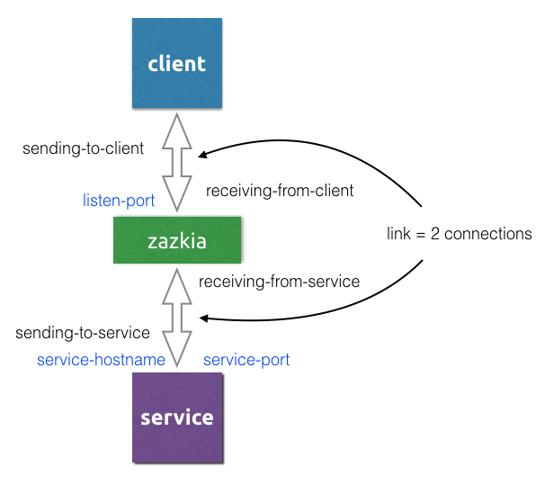

> zazkia
is a tool that simulates all kinds of connection problems with a tcp connection (reset,delay,throttle,corrupt).

### How does it work ?
In order to apply misbehavior, zazkia must be used as a proxy between a client and service.
It will accept tcp connections from a client and for each new one, will create a connection to the target service.

### Routes
By specifying routes, you can tell zazkia on what ports to listen and what target to connect to (host and port).

Minimal zazkia-routes.json example

	[
	    {
	        "label": "oracle",
	        "service-hostname": "some.host.name",
	        "service-port": 1521,
	        "listen-port": 49997
	    }
	]

With this route definition, your application should use "localhost:49997" instead of "some.host.name:1521" in the connection specification.
Your application (the client) will setup a tcp connection with zazkia which will setup another tcp connection to oracle (the service).

#### Initial transport behavior
The transport part of a route configuration can be used to setup the initial behavior of a new connection pair (called link).
Using a REST api, the transport behavior can be changed on a per-link basis.

Full zazkia-routes.json example

	[
	    {
	        "label": "postgresql",
	        "service-hostname": "some.other.host.name",
	        "service-port": 5432,
	        "listen-port": 49998,
	        "transport": {
				"accept-connections": true,
				"throttle-service-response": 1000,
				"delay-service-response": 100,
				"service-response-corrupt-method": "randomize",
				"sending-to-client": true,
				"receiving-from-client": true,
				"sending-to-service": true,
				"receiving-from-service": true,
				"verbose": true
	        }
	    }
	]

| transport property | comment | effective values |
|-----------|---------|--------|
| accept-connections | whether connections from the client are accepted | true, false |
| throttle-service-response | bytes per second | non-negative integer |
| delay-service-response | milliseconds delay | non-negative integer |
| service-response-corrupt-method | how the bytes are mangled | **empty**, randomize |
| sending-to-client | whether a response from the service is sent back to the client | true, false |
| receiving-from-client | whether a request from the client is read | true, false |
| sending-to-service | whether a request from the client is sent to the service | true, false|
| receiving-from-service | whether a response from the service is read | true, false | 
| verbose | log each message that is transported between client and service | true, false |

### Default transport behavior 

	"transport": {
		"accept-connections": true,
		"throttle-service-response": 0,
		"delay-service-response": 0,
		"service-response-corrupt-method": "",
		"sending-to-client": true,
		"receiving-from-client": true,
		"sending-to-service": true,
		"receiving-from-service": true,
		"verbose": false
	}

### Build

To build the project locally and test it.

	go get -u github.com/jteeuwen/go-bindata/...

Make sure $GOPATH/bin is on your $PATH.

	go generate
	go test
	go build

## Run

Defaults (-p 9191 -f zazkia-routes.json)

	./zazkia

### Dashboard
A simple HTML dashboard is available to change the transport behavior of individual links. See the Swagger tab for documentation of the REST API.

	http://localhost:9191

## Docker
A Docker image is available on Docker Hub.

### Usage

	docker run -d -p 9200-9300:9200-9300 -p 9191:9191 -v $(pwd):/data emicklei/zazkia

Zazkia will look for a file called **zazkia-routes.json**.
The web UI will be running on http://localhost:9191
When using Docker, routes must use listener ports in the range 9200-9300.

### Examples

See the examples folder for simple usecase examples.

### Build your own image

	GOOS=linux go build && docker build -t zazkia .

© 2017, [ernestmicklei.com](http://ernestmicklei.com).  Apache v2 License. Contributions welcome.	