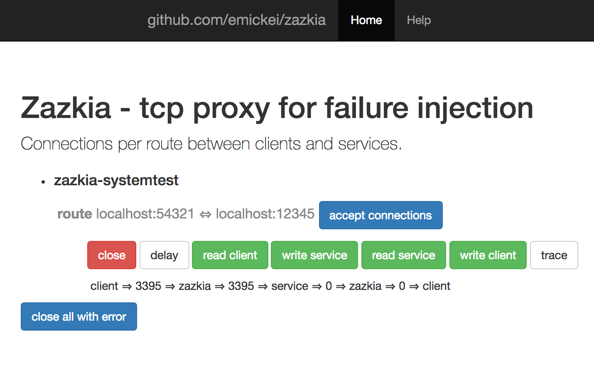

# zazkia systemtest

The clientserver.go is a program that starts a server and a client that connects and sends a packet in a loop.
The server is accepting connections on port 12345.
The client is connecting to 54321 and sends a simple text message every second.
The zazkia-routes.json has a route to link the client and server with zazkia as a proxy.

## start zazkia
First build the program in the project home and start it in the systemtest folder:

    go build
    cd systemtest
    zazkia

## start clientserver
In a different terminal, again in the systemtest folder:

    go run clientserver.go

## snapshot

